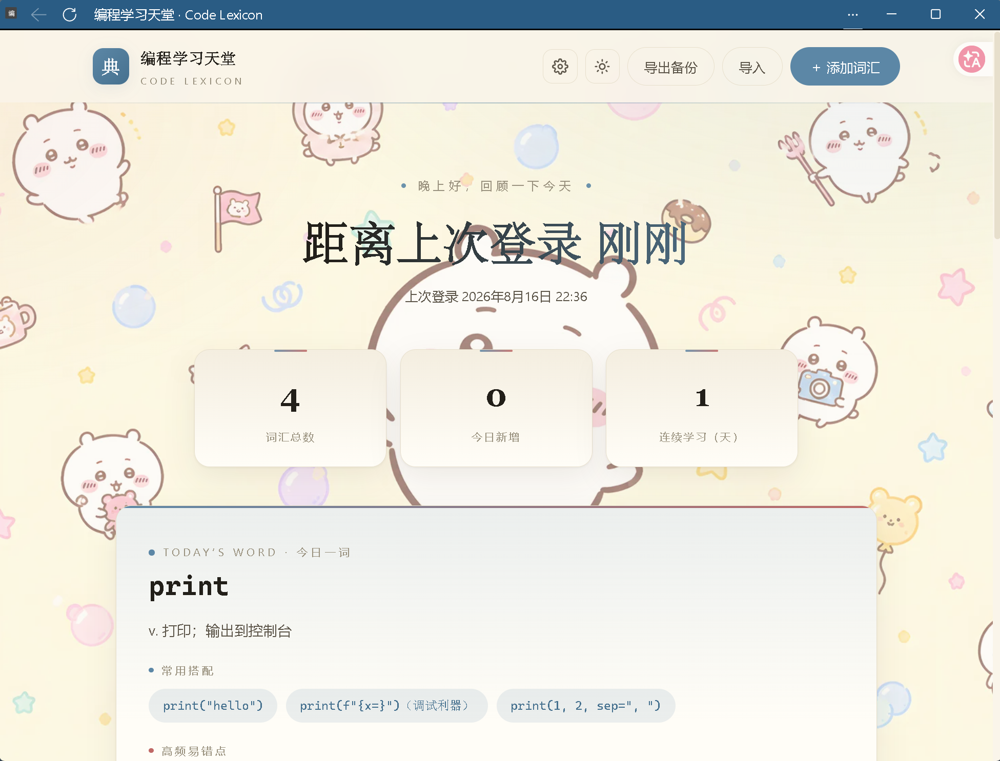

# 编程学习天堂 · Code Lexicon

一个极简的本地代码词汇学习网页。**双击 `index.html` 即可使用**，无需安装、无需联网、无需服务器。

## 功能

- **自由增删改词汇**：每个词条包含「术语 / 单词、释义、常用搭配、高频易错点」四个字段
  - 常用搭配：每行一条，自动渲染成标签（chip）
  - 高频易错点：每行一条，自动渲染成要点列表
- **学习记录**：打开页面即可看到
  - 距离上次登录过去了多久
  - 上次登录时间
  - 词汇总数、今日新增、连续学习天数
- **今日一词**：每天自动从词库中挑一个词供复习
- **搜索**：按术语、释义、搭配、易错点关键词过滤
- **深浅主题切换**：右上角月亮 / 太阳按钮
- **导出 / 导入备份**：数据以 JSON 文件备份，换设备或清理缓存后可通过「导入」恢复（同名词条会覆盖更新）

## 页面背景

右上角的齿轮按钮打开「页面背景设置」：

- **内置背景**：3 张吉伊卡哇背景（零食花纹 / 星空云朵 / 奶油极简），或「默认渐变」恢复纯色样式
- **自定义**：上传本地图片，或粘贴图片链接（https://…），图片会压缩后保存在本机
- **遮罩强度**：拖动滑块调整背景明暗与文字清晰度（浅色主题下自动使用浅色遮罩）
- 背景选择会自动保存，下次打开仍然生效
## 使用方式

1. 用浏览器打开 `index.html`
2. 点击右上角「＋ 添加词汇」录入词条，例如：

   - 术语：`import`
   - 释义：`v. 引入；导入（模块、库）`
   - 常用搭配：`import copy（深拷贝）`（每行一条）
   - 高频易错点：`各玩各的，互不影响`（每行一条）

3. 鼠标悬停词条卡片可「编辑 / 删除」

## 数据存储

- 数据保存在浏览器的 **localStorage** 中（仅本机、仅当前浏览器）
- 清理浏览器缓存 / 更换设备会丢失数据，请定期点击「导出备份」
- 恢复方式：点击「导入」选择之前导出的 JSON 文件

## 键盘快捷键

- `/`：聚焦搜索框
- `Esc`：关闭弹窗

## 🚀 进阶玩法：安装成桌面应用

Edge/Chrome 的「安装为应用」只认 http 地址，本地文件装不了。
想把它变成桌面 App，先启动本地服务器：

python -m http.server 8000

或直接运行本仓库的 server.py，然后打开 http://localhost:8000，
在浏览器菜单里选择「将此站点作为应用安装」。

## 🌐 在线体验

https://WTFZYX.github.io/编程学习天堂/

## 🛠 技术栈

HTML / CSS / JavaScript，纯前端零依赖，数据保存在浏览器 localStorage。

